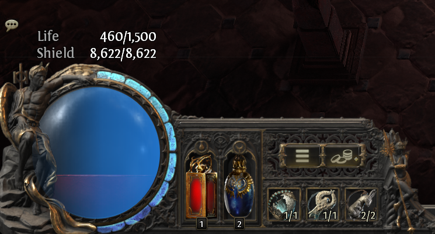
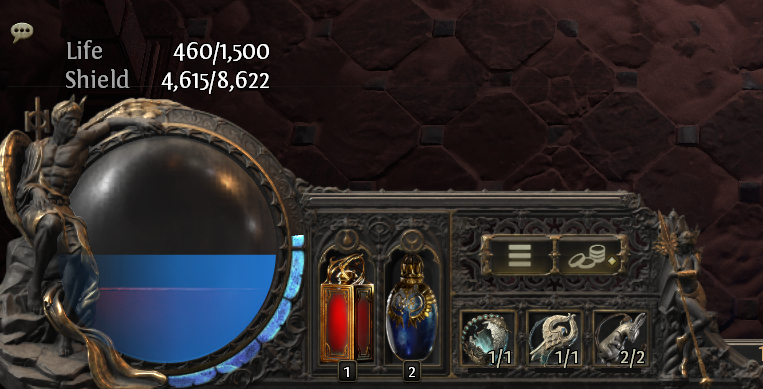
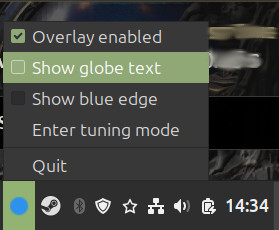
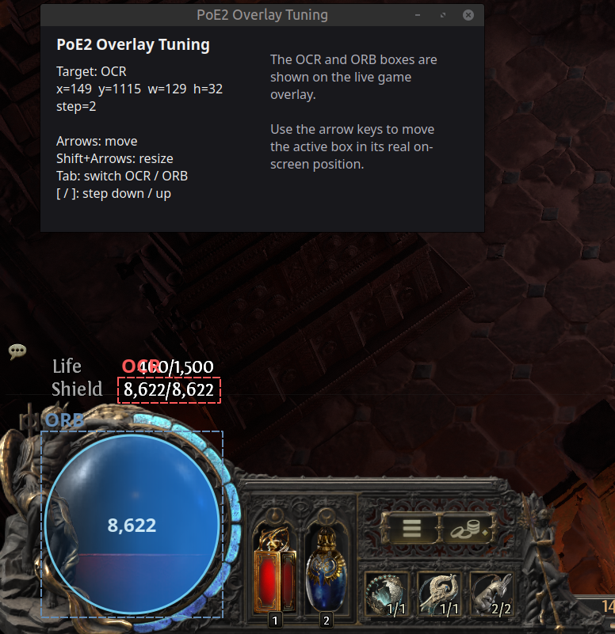

# poe2-es-overlay

A lightweight Path of Exile 2 overlay for displaying OCR-detected text on screen.

## What it does

This project captures part of the screen, processes the image, runs OCR, and displays the detected text in an overlay window.

## Screenshots

Energy Shield when full:



Energy Shield when damaged:



Configuration Widget:



Tuning Screen (used to reposition the OCR area or the ES Globe)



## Features

- Screen region capture
- OCR text extraction
- Overlay window display
- Python-based local desktop app

## Requirements

- Python 3
- Linux desktop environment
- Tesseract OCR installed on the system
- Python dependencies from your virtual environment

## Setup

1. Clone the repository:

```bash
git clone https://github.com/ArchonAus/poe2-es-overlay.git
cd poe2-es-overlay
```

2. Create and activate a virtual environment:

```bash
python3 -m venv .venv
source .venv/bin/activate
```

3. Install Python dependencies:

```bash
python -m pip install pyqt5 pillow pytesseract python-xlib pyinstaller
```

4. Make sure Tesseract OCR is installed on your system.

## Run from source

```bash
source .venv/bin/activate
python overlay2.py
```

## Build executable

```bash
source .venv/bin/activate
python -m PyInstaller --name poe2-es-overlay --windowed --onefile overlay2.py
```

The built executable will be created in `dist/`.

## Run executable

```bash
./dist/poe2-es-overlay
```

## Project files

- `overlay2.py` — current main version
- `overlay.py` — earlier version

## Notes

- The app may require additional Linux desktop dependencies depending on your environment.
- If OCR does not work, confirm that the `tesseract` binary is installed and available in your `PATH`.
- In Path of Exile 2 you MUST have your Life/ES values displayed above the globes (see screenshot above). These values are what is read by the OCR.

## How to use the tuning tool

1. Start Path of Exile 2
2. Run the overlay:

```bash
source .venv/bin/activate
python overlay2.py
```

3. From the system tray widget, choose "Enter tuning mode"
4. Make sure PoE2 is visible in the background with the tuning window in front and actively selected.
5. Use the arrows keys to move the red OCR box to encompass your ES current/full value (see screenshot above)
6. If you need to resize the box, use Shift+arrows
7. Press tab to toggle between the OCR box (Red) and the ORB box (blue). Resize the blue box to the size of your life globe (see screenshot above)
8. Press CTRL+S to save the new config.

## License

This project is licensed under the MIT License — see the [LICENSE](LICENSE) file for details.
